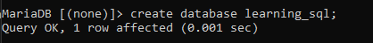
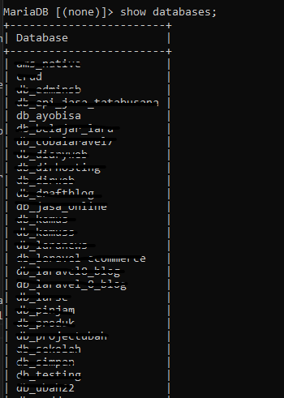

<h2> Learning SQL Basic</h2>

 
<ol>
<li>
<a href="#cd">How to Create Database</a>
</li>
<li>
<a href="#sd">How to Show Databases</a>
</li>
<li>
<a href="#ct">How to Create Table</a>
</li>
<li>
<a href="#st">How to Show Tables</a>
</li>
<li>
<a href="">How to Insert Table</a>
</li>
<li>
<a href="">How to Update Table</a>
</li>
<li>
<a href="">How to Delete Table</a>
</li>
<li>
<a href="">How to Show Database and Table</a>
</li>
<li>
<a href="">How to Get Data from Table</a>
</li>
<li>
<a href="">How to Join Data Table </a>
</li>
<li>
<a href="">How to Group By Table</a>
</li>
</ol>

  

<ol>
<li id="cd">
How to Create Database

CREATE DATABASE learning_sql;

</li>
<li id="sd">
How to Show Database

SHOW DATABASES;

</li>
<li id="ct">
How to Create Table

<pre>CREATE TABLE table_students (
    nim int(11) primary key,
    name char(20) NOT NULL,
    university char(20) NOT NULL,
    gender char(11) NOT NULL,
    age int(3) NOT NULL,
    nationality char(10) NOT NULL
    );
</pre>

</li>
</ol>

