
<h2> Learning SQL Basic</h2>

 
<ol>
<li>
<a href="#cd">How to Create Database</a>
</li>
<li>
<a href="#sd">How to Show Databases</a>
</li>
<li>
<a href="#ct">How to Create Table</a>
</li>
<li>
<a href="#it">How to Insert Table</a>
</li>
<li>
<a href="#adc">How to Add Column</a>
</li>
<li>
<a href="#dc">How to Drop Column</a>
</li>
<li>
<a href="#mc">How to Modify Column</a>
</li>
<li>
<a href="#cc">How to Change Column</a>
</li>
<li>
<a href="#ut">How to Update Table</a>
</li>
<li>
<a href="#dt">How to Delete Table</a>
</li>
<li>
<a href="#rt">How to Rename Table</a>
</li>
<li>
<a href="sd">How to Select</a>
</li>
<li>
<a href="">How to Get Data from Table</a>
</li>
<li>
<a href="">How to Join Data Table </a>
</li>
<li>
<a href="">How to Group By Table</a>
</li>
</ol>

  

<ol>
<li id="cd">
How to Create Database

<pre>CREATE DATABASE learning_sql;</pre>

</li>
<li id="sd">
How to Show Database

<pre>SHOW DATABASES;</pre>

</li>
<li id="ct">
How to Create Table

<pre>CREATE TABLE table_students (
    nim int(11) primary key,
    name char(20) NOT NULL,
    university char(20) NOT NULL,
    gender char(11) NOT NULL,
    age int(3) NOT NULL,
    nationality char(10) NOT NULL
    );
</pre>

<pre>
SHOW TABLES;
</pre>

<pre>
DESC table_students;
</pre>

</li>
<li id="it">
How to Insert Table

<pre>INSERT INTO table_students VALUES
    (12340, 'Liana', 'Universitas Indonesia', 'Female', 20, 'Indonesia'),
    (12341, 'Bayu', 'Harvard University', 'Male', 21, 'Amerika Sarikat'),
    (12342, 'Garman', 'Istanbul University', 'Male', 21, 'India'),
    (12343, 'Rahel', 'Harvard University', 'Male', 20, 'Amerika Sarikat'),
    (12344, 'Xia', 'Perak University', 'Female', 20, 'Malaysia'),
    (12345, 'Zian Dewi', 'Universitas Indonesia', 'Female', 22, 'Korea');
</pre>

<pre>select* from table_students;
</pre>

</li>
<li id="adc">
How to Add Column

<pre>
ALTER TABLE table_students ADD level int(3);
</pre>
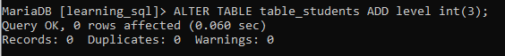
<pre>desc table_students;
</pre>
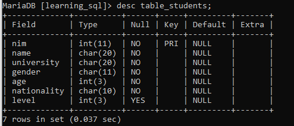
</li>

<li id="dc">
How to Drop or Delete Column

<pre>
ALTER TABLE table_students DROP COLUMN level;
</pre>

<pre>desc table_students;
</pre>
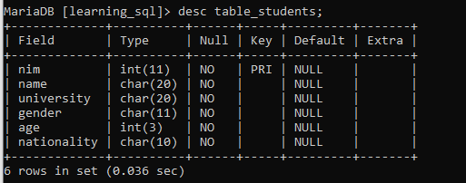
</li>

<li id="mc">
How to Modify Column

<pre>ALTER TABLE table_students MODIFY nim BIGINT;
</pre>
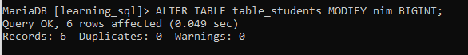
<pre>desc table_students;
</pre>
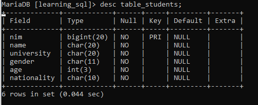
</li>

<li id="cc">
How to Change Column

<pre>ALTER TABLE table_students CHANGE nationality kebangsaan char(10);
</pre>
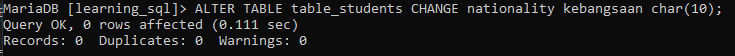
<pre>desc table_students;
</pre>
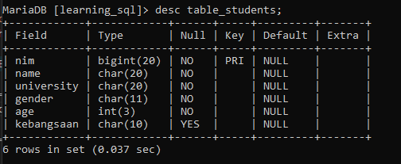
</li>

<li id="ut">
How to Update Table

<pre>UPDATE peserta SET university = 'Universitas Gajah Mada' WHERE name = 'Xia';
</pre>
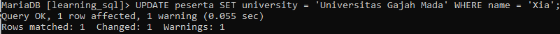
<pre>select* from peserta;</pre>
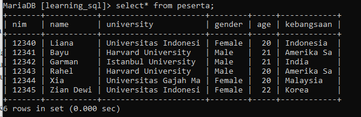

<pre>UPDATE peserta SET kebangsaan = 'Jakarta' WHERE name = 'Zian Dewi' OR nim = 12344;</pre>
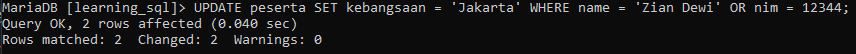

<pre>select* from peserta;</pre>

</li>

<li id="rt">
How to Rename Table

<pre>ALTER TABLE table_students RENAME TO peserta;
</pre>
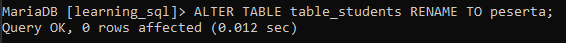
<pre>show tables;
</pre>
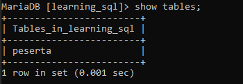
</li>

<li id="sd">
How to Select

<pre>INSERT INTO table_students VALUES
    (12340, 'Liana', 'Universitas Indonesia', 'Female', 20, 'Indonesia'),
    (12341, 'Bayu', 'Harvard University', 'Male', 21, 'Amerika Sarikat'),
    (12342, 'Garman', 'Istanbul University', 'Male', 21, 'India'),
    (12343, 'Rahel', 'Harvard University', 'Male', 20, 'Amerika Sarikat'),
    (12344, 'Xia', 'Perak University', 'Female', 20, 'Malaysia'),
    (12345, 'Zian Dewi', 'Universitas Indonesia', 'Female', 22, 'Korea');
</pre>

<pre>select* from table_students;
</pre>

</li>
</ol>

